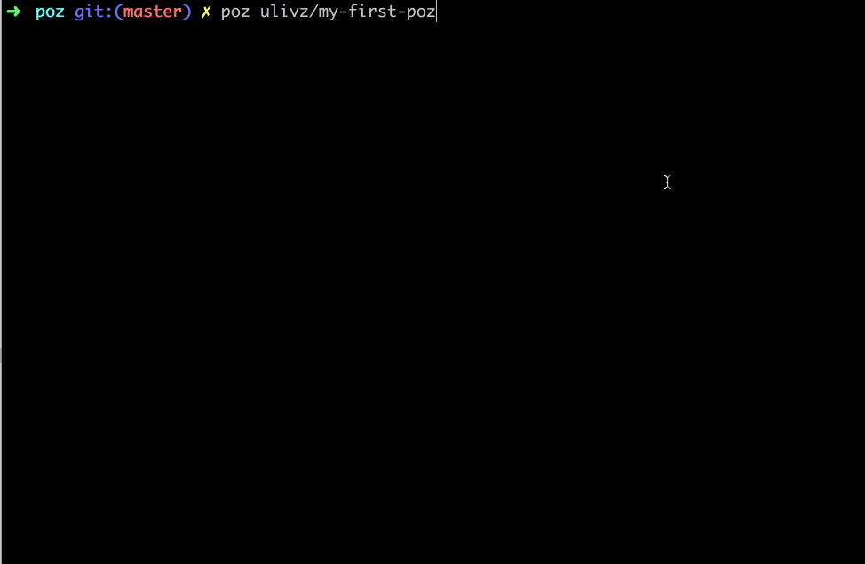

<p align="center">

</p>

<p align="center">
<br>
<a href="https://npmjs.com/package/poz"></a> 
<a href="https://npmjs.com/package/poz"></a> 
<a href="https://circleci.com/gh/ulivz/poz"></a> 
<a href="https://github.com/ulivz/donate"></a> 
<a href="https://codecov.io/gh/ulivz/poz" alt="codecov"> </img> </a>
</p>


## Overview

All along, I always hope to have a _intelligent_ tool which can do some __GENERRATE__ work for me. It should be friendly, so it should be as simple as possible to use. It should be flexible enough, so it should be given the ability to _program_ and _extend_. At the same time, it should also have some _self-management capabilities_, so I do not have to consider the complexity of mulitple templates. With these considerations in mind, I made **POZ**.

__POZ__ is a programmable scaffolding generator, you just need to write a [POZ package](#poz-package) which can help you quickly implement a scaffolding that reuses project templates like [vue-cli](https://github.com/vuejs/vue-cli).

**POZ** support package at:

- __Github__ repo POZ package
- __NPM__ package POZ package
- __local folder__ POZ package

## POZ Package

A simple POZ package might have the following structure:

```
|____poz.js
|____README.md
|____template
  |____file-01
  |____file-02
```

You have to provide at least the `poz.js` file and `template` folder, where the `template` folder are used to store your project's template files, and the `poz.js` will be the entry file you configure and program, a simple `poz.js` as follows:

```js
module.exports = function (context, poz) {
  return {
    prompts() {
      return {
        name: {
          message: "What's your name?",
          validate: v => v ? true : 'name cannot be empty'
        },
        lang: {
          message: 'Which language do you usually write?',
          type: 'list',
          choices: ['js', 'go', 'py'],
          default: 'js'
        }
      }
    },
    dest() {
      return {
        target: context.name,
        rename: {
          '{lang}': context.lang,
        }
      }
    }
  }
}
```

If your template folder is as follows:

```bash
my-first-poz
|____poz.js
|____README.md
|____template
  |____index.{lang}  # contents: 'My name is {{ name }}'
```

Then run `poz ulivz/my-first-poz`:



You can get this demo package at [here](https://github.com/ulivz/my-first-poz). Check all the documents, please move [DOCS](#).

## Install

Install _poz_:

```bash
# Either globally
yarn global add poz
# Or locally (preferred)
yarn add poz --dev
```

or, If you use `npm`:

```bash
npm i poz -g
npm i poz --save-dev
```

## Contributing

1. Fork it!
2. Create your feature branch: `git checkout -b my-new-feature`
3. Commit your changes: `git commit -am 'Add some feature'`
4. Push to the branch: `git push origin my-new-feature`
5. Submit a pull request :D

# Prior art

`poz` wouldn't exist if it wasn't for excellent prior art, `poz` is inspired by these projects:

- [sao](https://github.com/saojs/sao)
- [vue-cli](https://github.com/vuejs/vue-cli)

## Author

**poz** © [ULIVZ](https://github.com/ulivz), Released under the [MIT](./LICENSE) License.

Authored and maintained by ULIVZ with help from contributors ([list](https://github.com/ulivz/poz/contributors)).

> [v2js.com](http://v2js.com) · GitHub [@ULIVZ](https://github.com/ulivz)
